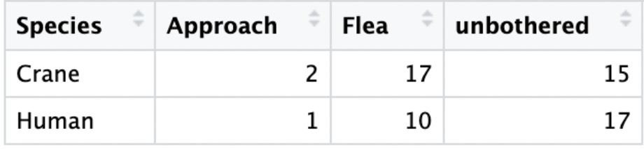
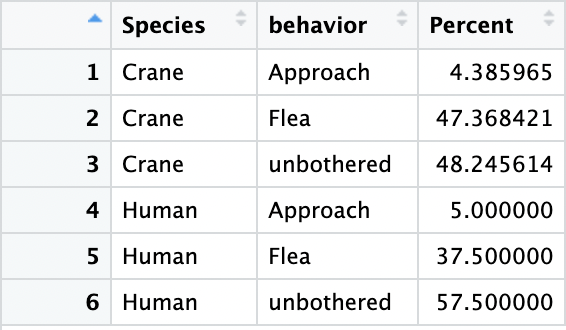
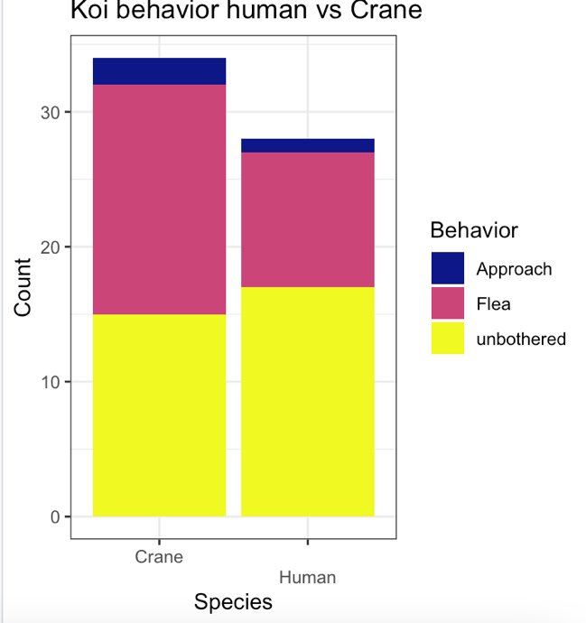
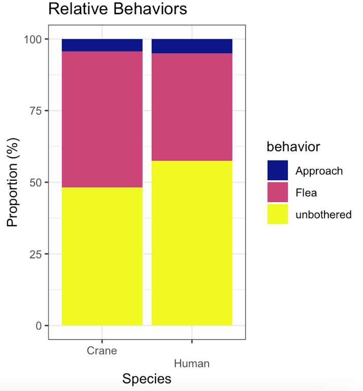

# Koi Fish Show More Intense Interactions with Predatory Stimuli than to Human Interaction: A Study at SDSU Turtle Pond

**Author:** Evan Kordovi  
**Date:** 05/01/2023

## Introduction

Koi fish (*Cyprinus rubrofuscus*), also known as nishikigoi, are a popular species of attractive fish that originally was domesticated in Japan during the 1820s (Ng. 2016). Over centuries these fish have been selectively bred for their beauty and the different colors that represent different good qualities, such as good luck, success, perseverance, ambition, and courage in certain cultures, especially the practice of feng shui common in Asian cultures. Koi fish are a relatively smart species that has the ability to discern the difference between different types of stimuli. A study conducted by Yen and Lin in 2015 performed an experiment that investigated the behavioral response of Koi fish to different stressors such as a heron and a fishing net. It was found that the Koi fish clearly responded differently to the different stimuli that were provided. They also found that Koi fish exposed to a stimulus for the first time experienced much more intense response (Yen & Lin, 2015).

Because Koi fish have been domesticated for so long, I investigated published research papers about how Koi fish interact with human stimuli. "Koi have a natural inclination to seek out tactile interaction with humans and do so more frequently than previously thought, with individual differences in the degree to which koi will seek out contact with humans." (Fife-Cook and Becca Franks. 2021). Throughout my experiment, I aim to explore how Koi fish interact with different stimuli, including human interaction and a predatory stimulus such as a simulated crane, to better understand their behavior and responses.

In this study, we aim to investigate how Koi fish interact with different stimuli, including human interaction and a simulated crane, to better understand their behavior and responses. The simulated crane is meant to represent a new predatory stimulus that the Koi fish in the SDSU turtle pond are not familiar with. Meanwhile, the Koi fish in the pond are exposed to many humans every day because they are in an area that has a lot of human foot traffic in the middle of a big college campus. It was hypothesized that Koi-human interactions will be less intense, and the Koi fish will be mostly unbothered by the human hand in their habitat. On the other hand, it was expected that the Koi fish to have a more intense response to the simulated crane by either approaching or fleeing the predatory stimulus. The null hypothesis of this experiment is that there is no significant difference between the interactions of Koi fish and cranes compared to Koi fish and humans. In completing this experiment insight will be gained about the behavior and reaction of Koi fish to different types of stimuli.

## Methods

This experiment took place over a three-day period between April 7 – 9 2023 during the early evening between 5 and 9 pm. The trials occurred on different days to reduce the effect of extraneous variables such as weather or if there was lots of human disturbance on one of the days. I decided to perform the trials in the evening time because it worked well with my schedule, and was also a time of day with slightly less humans walking around the turtle pond causing disturbance. On all three days the temperature was approximately the same around 15 degrees Celsius, except on April 8 where I performed the trial at around 9 pm at the temperature was close to 11 degrees Celsius.

To collect the data, I first put the crane into an area of the pond and dipped it into the pond. During this minute of dipping, I recorded the behavior of every Koi fish that interacted (came within 1m of stimulus) with the crane as either: approaching the crane, fleeing the crane, or unbothered by the crane. After a minute I moved to a different area of the pond and did this again for a total of 10 minutes each day. The same exact methods were also done with a human hand instead of the simulated crane. Looking at the three behaviors of the fish every minute and getting multiple trials allows us to see if there is a significant difference between the two relationships, the goal of this experiment.

First, the variables for the behaviors were converted into factors. Then the raw data collected was aggregated into the total number of occurrences for each behavior for each relationship. The relative proportions of each behavior for both relationships were calculated by dividing the total number of occurrences of each behavior by the total number of Koi fish observed in each relationship. To determine if there were any significant differences between the two relationships, a chi-square test with three degrees of freedom was conducted, comparing the proportion of each behavior for the human and crane relationships.

## Results

The behavior of the Koi fish in each scenario were observed and assessed into 3 categories: approach, flea, and unbothered. With the data compiled after adding up all the trials and observations a bar graph showing the total occurrence of each behavior in the different relationships is shown in Figure 1. It can be seen in Table 1 that the Koi fish fled the crane 7 more times than the human hand across the experiment, but to get a better picture of the data and to run analysis the relative proportions of behaviors were calculated because there were different amounts of Koi fish observed for each section of the experiment. Table 2 displays the proportion of each behavior exhibited by the Koi fish in response to the Human hand and the simulated crane, respectively. Interestingly, the Koi fish were observed to be unbothered by the Human hand a greater proportion of the time compared to the simulated crane (57.5% vs. 48.24%, respectively). This data can be visualized in Figure 2, where it can be seen in yellow that there was a higher proportion of Koi’s that were unbothered by humans than by the simulated crane.

Although patterns can be seen in the data and in the graphs, the data was most likely different due to chance because the Chi-square test and p value indicated that there is no true association between the variables (X-Square = 1.997, p = 0.368). The human and the crane interactions with the koi fish were not significant and were likely only due to chance. We fail to reject the null hypothesis that there is no difference between the koi interactions with humans and simulated cranes at the SDSU turtle pond.

**Table 1 - Total occurrence of each behavior**



**Table 2 - Relative proportion of each behavior**





**Figure 1 - Total occurrence of each behavior for Koi-Crane and Koi-Human relationships.**



**Figure 2 - Relative proportions of each behavior for Koi-Crane and Koi-Human relationships**

## Discussion

This study investigated how Koi fish interact with different stimuli to better understand Koi behaviors and responses. From the results of this study, it is suggested that Koi fish may be more accustomed to human interactions in the SDSU turtle pond, and may respond more intensely to novel stimuli like a crane, but the data was not significant.

There could be multiple different reasons for the trends that were seen in this study. One example discussed earlier could be that the Koi fish may be more accustomed to human presence because they are in the middle of a college campus, this will be less threatened by the presence of the human hand. This may explain why the Koi had a more intense response to the simulated crane. Another similar explanation for the trends could be that humans feed the koi fish and they believe they are being fed. It is also a high probability that the trends were solely due to chance because the chi-square and p value that was calculated from the analysis. This could be because of human error, an example of this could be that the depth of the Koi fish could have been mis observed and there’s a possibility that extra interactions were observed as unbothered when they really didn’t even notice the stimuli. The results somewhat matched what was expected before conducting the experiment, but the data was not significant to be certain. The trends did however match the findings from a paper discussed in the introduction that Koi fish react more intensely to novel stimulus than ones previously seen (Yen & Lin, 2015).

Future studies can be conducted in areas where Koi fish are not normally in so much contact with humans daily to test if the trends are the same because the Crane is a predator or if it is because the Koi fish are not used to the Cranes. Additionally, other stimuli can be studied with Koi fish interactions such as other fish, or a stronger predator to the Koi fish such as a coyote.

In conclusion, the results of this experiment suggest that Koi fish are more unbothered by crane interactions than by human interactions. However, further research is needed to confirm these findings and explore the response of Koi fish to other types of stimuli. The findings have practical implications for the management of Koi fish and their habitats.

## References

1.  Ismail, A. M., & Yusof, N. (2015). The ornamental freshwater fish trade in Malaysia. International Journal of Agriculture, Forestry and Plantation, 2(4), 158-165. <http://myagric.upm.edu.my/id/eprint/16594/1/V2N4TheornamentalfreshwaterfishtradeinMalaysia.pdf>

2.  Fife-Cook, Isabel, and Becca Franks. “Koi (Cyprinus Rubrofuscus) Seek out Tactile Interaction with Humans: General Patterns and Individual Differences.” *Animals*, vol. 11, no. 3, 2021, p. 706., https://doi.org/10.3390/ani11030706.

3.  Yen, J. D., & Lin, H. J. (2015). Behavioral responses of Koi (Cyprinus carpio) to different simulated predatory stressors. Applied Animal Behaviour Science, 171, 37-43. doi: 10.1016/j.applanim.2015.08.007

## R Data Analysis

```r
# Clear Current environment

rm(list=ls())

setwd("~/Desktop/Spting 23'/BIOL354L")

library(ggplot2)

library(tidyr)

library(dplyr)

library(cowplot)

# Read in CSV file

control <- read.csv("koi behavior experiment - Control F.csv")

behavior <- read.csv("koi behavior experiment - crane-koi-human.csv")

# convert species into factors

behavior$Species<-as.factor(behavior$Species)

head(behavior)

# Aggregate behavior data into proportion time

behaviortotal <- behavior %>%

group_by(Species) %>%

summarize(Approach=sum(Approach),

Flea=sum(Flea),

unbothered=sum(unbothered))

# Initial Plot of behavior results

behaviorplot <- behaviortotal %>%

pivot_longer(cols=c("Approach","Flea","unbothered"),

names_to="Behavior", values_to="TotalOccurance")

behaviorplot$Behavior<-factor(behaviorplot$Behavior,

levels=c("Approach","Flea","unbothered"))

head(behaviorplot)

ggplot(behaviorplot, aes(x=Species, y=TotalOccurance, fill=Behavior))+

geom_col()+

scale_fill_viridis_d(option="C")+

theme_bw()+

ggtitle("Koi behavior human vs Crane")+

labs(x="Species",y="Count",fill="Behavior")+

scale_x_discrete(guide = guide_axis(n.dodge=2)) #This ensures the x-axis labels don't overlap

# Lets make these relative proportions

behaviorratio<-behavior %>%

filter(koi.count>0) %>% #Ensures we don't divide by zero

mutate(ApproachPercent=Approach/koi.count*100,

FleaPercent=Flea/koi.count*100,

unbotheredPercent=unbothered/koi.count*100) %>%

group_by(Species) %>%

summarize(Approach=mean(ApproachPercent),

Flea=mean(FleaPercent),

unbothered=mean(unbotheredPercent))

# Reformatting the data

behaviorplot2 <- behaviorratio %>%

pivot_longer(cols=c("Approach","Flea","unbothered"),

names_to="behavior", values_to = "Percent") %>%

mutate(behavior = factor(behavior,

levels=c("Approach","Flea","unbothered")))

head(behaviorplot2)

ggplot(behaviorplot2, aes(x=Species, y=Percent, fill=behavior))+ #HINT: which dataset are we using?

geom_col()+

scale_fill_viridis_d(option="C")+

theme_bw()+

ggtitle("Relative Behaviors")+

labs(x="Species",y="Proportion (%)",fill="behavior")+

scale_x_discrete(guide = guide_axis(n.dodge=2))

# Chi-square test (3 behaviors, campared b/w the 2 species)

chisq.test(behaviorratio[,c("Approach", "Flea", "unbothered")], behaviorratio$Species)
```
